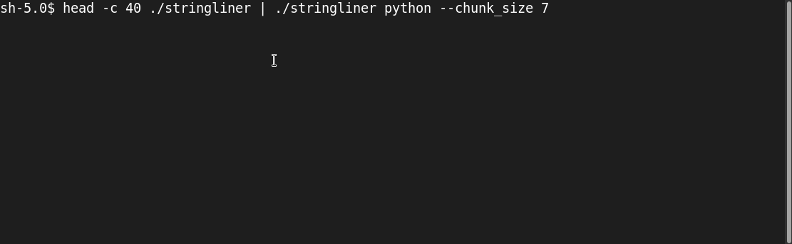

# stringliner
It inlines stuff as strings.
Supported languages: C, golang, python, rust.

Comments of printables can be disabled by the option `--noprintables`.



## Examples

``` sh
tail -c 50 ./stringliner | ./stringliner clang --name test_bytes
tail -c 50 ./stringliner | ./stringliner python --name test_bytes --chunk_size 8
```


